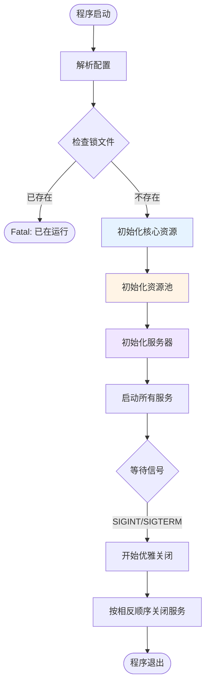
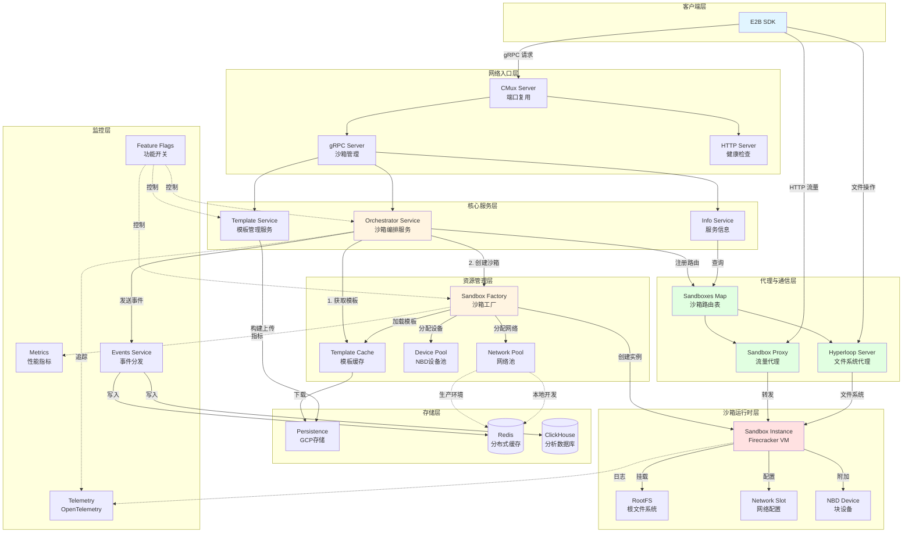
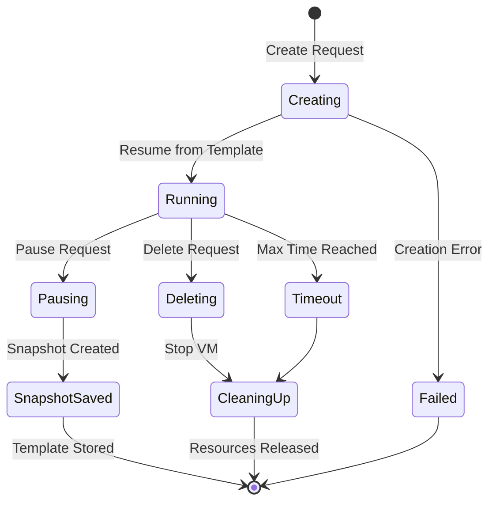
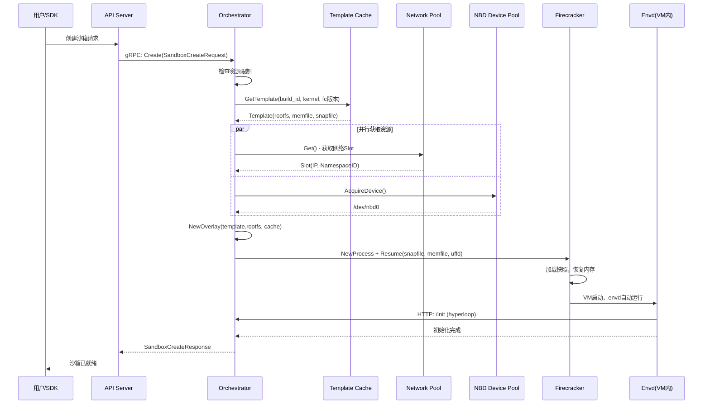
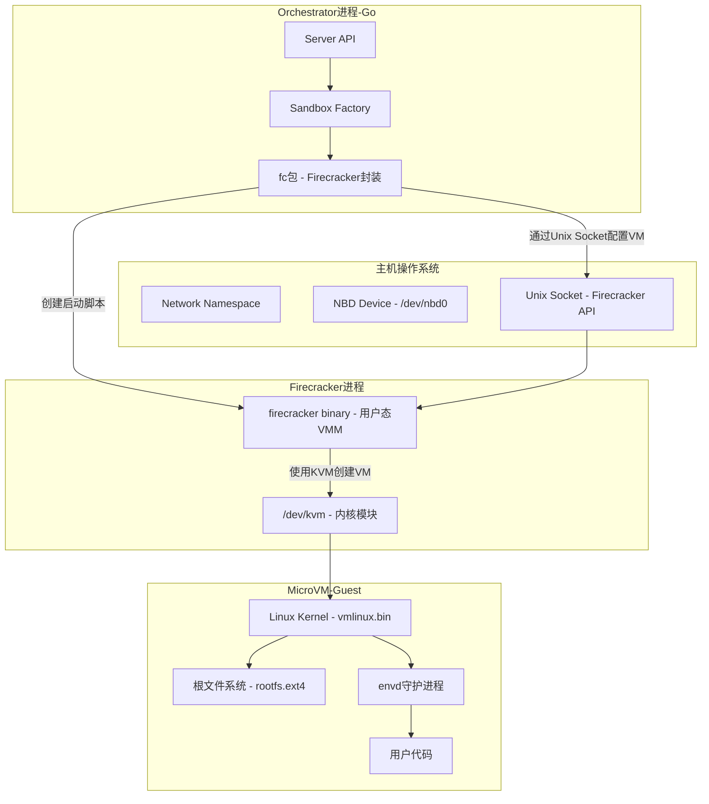
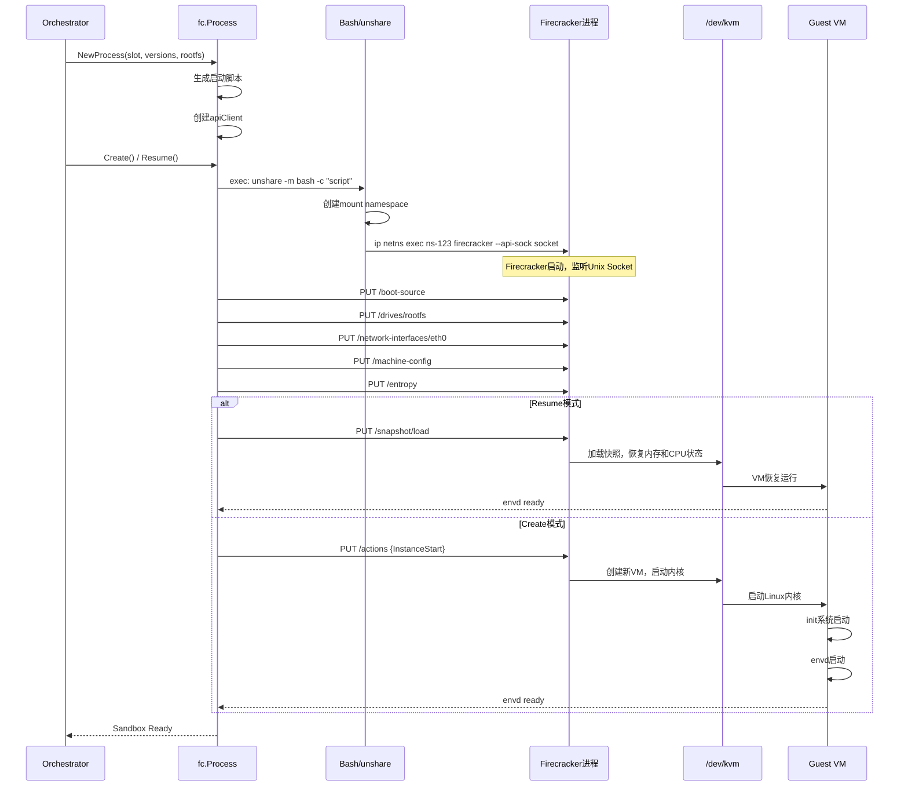
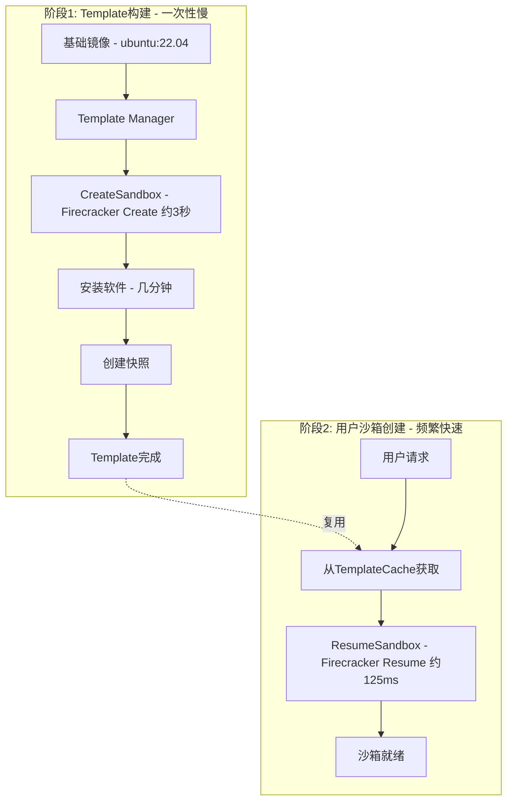

# E2B Orchestrator 调研文档

> 基于对话整理 - 2025年11月19日

---

## 目录

1. [E2B核心价值](#1-e2b核心价值)
2. [Orchestrator架构概览](#2-orchestrator架构概览)
3. [核心概念深入](#3-核心概念深入)
4. [Firecracker集成](#4-firecracker集成)
5. [启动流程对比](#5-启动流程对比)

---

## 1. E2B核心价值

### 1.1 项目定位

**E2B = 为AI代码解释器提供的开源基础设施**

- **核心问题**：AI生成的代码是不可信的，直接在生产服务器执行存在安全风险
- **解决方案**：提供安全、高性能、隔离的代码执行环境

### 1.2 技术选型：Firecracker MicroVM

E2B使用**Firecracker**而非Docker容器，关键对比：

| 特性       | Docker容器    | E2B沙箱 (Firecracker) |
| -------- | ----------- | ------------------- |
| **隔离级别** | 进程级隔离（共享内核） | **硬件级隔离（独立内核）**     |
| **启动速度** | ~秒级         | **~125ms**          |
| **安全性**  | 中等（容器逃逸风险）  | **非常高（虚拟机级别）**      |
| **快照支持** | 有限          | **完整内存+磁盘快照**       |
| **内核定制** | 不支持         | **支持（每个VM独立内核）**    |

**关键发现**：代码位置 `packages/orchestrator/internal/sandbox/fc/`

### 1.3 核心API

Proto定义：`packages/orchestrator/orchestrator.proto:114-122`

```protobuf
service SandboxService {
  rpc Create(SandboxCreateRequest) returns (SandboxCreateResponse);
  rpc Update(SandboxUpdateRequest) returns (google.protobuf.Empty);
  rpc List(google.protobuf.Empty) returns (SandboxListResponse);
  rpc Delete(SandboxDeleteRequest) returns (google.protobuf.Empty);
  rpc Pause(SandboxPauseRequest) returns (google.protobuf.Empty);
  rpc ListCachedBuilds(google.protobuf.Empty) returns (SandboxListCachedBuildsResponse);
}
```

### 1.4 典型应用场景

- AI代码助手（如Cursor、GitHub Copilot）执行生成的代码
- Jupyter Notebook云服务
- 在线编程教育平台
- 代码评测系统
- Serverless函数计算

---

## 2. Orchestrator架构概览

### 2.1 Main.go执行流程

**入口文件**：`packages/orchestrator/main.go`



**关键设计模式**：

- **Closer模式**：统一资源管理，LIFO顺序关闭
- **ErrorGroup模式**：并发服务管理
- **CMux模式**：端口复用（同时支持HTTP和gRPC）

### 2.2 核心服务详解

#### 服务架构全景图



#### 各服务详细说明

| 服务                   | 代码位置                                              | 职责         | 比喻              |
| -------------------- | ------------------------------------------------- | ---------- | --------------- |
| **CMux Server**      | `internal/factories/cmux.go`                      | 端口复用，协议路由  | 门卫：根据来访者身份指路    |
| **gRPC Server**      | `main.go:402-435`                                 | 管理API，接收命令 | 总机：接听电话，下达指令    |
| **HTTP Server**      | `main.go:458-480`                                 | 健康检查       | 体检中心：随时报告健康状态   |
| **Sandbox Proxy**    | `internal/proxy/proxy.go:37-112`                  | 流量路由到沙箱    | 快递员：把包裹送到正确房间   |
| **Hyperloop Server** | `internal/hyperloopserver/handlers/logs.go:14-64` | 日志收集代理     | 邮局：收集并转发所有信件    |
| **Network Pool**     | `internal/sandbox/network/pool.go:108-129`        | 预创建网络命名空间  | 泳池：预先准备好泳道供使用   |
| **NBD Device Pool**  | `internal/sandbox/nbd/pool.go:70-101`             | 管理块设备      | 储物柜管理员：分配和回收储物柜 |

**关键代码位置**：

- 资源初始化：`main.go:231-349`
- 服务启动：`main.go:206-225`（startService函数）
- 优雅关闭：`main.go:495-543`

---

## 3. 核心概念深入

### 3.1 Template（模板）

#### 3.1.1 概念定义

**Template = 预构建的环境镜像**

类比关系：

- Docker Image → E2B Template
- Docker Container → E2B Sandbox

**Template接口定义**：`internal/sandbox/template/template.go:14-21`

包含组件：

1. **Rootfs（根文件系统）** - ext4格式的磁盘镜像
2. **Memfile（内存快照）** - VM的内存状态
3. **Snapfile（虚拟机快照）** - Firecracker VM的完整状态
4. **Metadata（元数据）** - 配置信息、版本号等

#### 3.1.2 Template配置

**Proto定义**：`template-manager.proto:61-88`

构建流程类似Dockerfile：

- 支持RUN、COPY等步骤
- 可基于基础镜像或其他模板
- 支持自定义内核版本和Firecracker版本

#### 3.1.3 Copy-on-Write机制

这是E2B性能的关键！

**架构示意**：

```
┌─────────────────────────────────────────────────────────┐
│                  Template (只读)                         │
│  rootfs.ext4 (2GB) - 存储在GCS，所有沙箱共享             │
└─────────────────────────────────────────────────────────┘
                        ▼ 共享（只读访问）
      ┌──────────────┬──────────────┬──────────────┐
      │  Sandbox 1   │  Sandbox 2   │  Sandbox 3   │
      │  Overlay     │  Overlay     │  Overlay     │
      │  Cache 32MB  │  Cache 32MB  │  Cache 32MB  │
      │  /dev/nbd0   │  /dev/nbd1   │  /dev/nbd2   │
      └──────────────┴──────────────┴──────────────┘
```

**核心实现**：`internal/sandbox/block/overlay.go:12-49`

**Overlay读操作逻辑**（`overlay.go:67-88`）：

1. 先尝试从cache（写入层）读取
2. 如果cache中没有 → 从device（只读模板）读取

**Overlay写操作**（`overlay.go:67-69`）：

- 所有写入直接去cache
- 永远不修改原始模板

**性能优势**：

| 场景                 | 传统方式（复制整个镜像）      | E2B方式（Overlay）           |
| ------------------ | ----------------- | ------------------------ |
| **启动100个Python沙箱** | 100 × 2GB = 200GB | 2GB + 100 × 32MB = 5.2GB |
| **启动时间**           | 需要复制2GB × 100     | 几乎无需复制，瞬间启动              |
| **内存占用**           | 每个独立加载            | 共享只读页，节省内存               |

**创建Overlay的代码位置**：

- Sandbox Factory：`internal/sandbox/sandbox.go:199-222`
- NBD Provider：`internal/sandbox/rootfs/nbd.go:33-58`

### 3.2 Sandbox（沙箱）

#### 3.2.1 结构定义

**代码位置**：`internal/sandbox/sandbox.go:105-123`

核心组件：

- **Resources**（资源）：`sandbox.go:86-90`
  
  - Slot - 网络命名空间
  - rootfs - 根文件系统提供者
  - memory - 内存后端（UFFD）

- **Metadata**（元数据）：`sandbox.go:96-103`
  
  - Config - 配置信息（`sandbox.go:52-67`）
  - RuntimeMetadata - 运行时信息（`sandbox.go:77-84`）

- **process** - Firecracker虚拟机进程

- **Template** - 关联的模板

#### 3.2.2 生命周期状态图



#### 3.2.3 创建流程

**完整时序图**：



**关键代码位置**：

- API Create入口：`internal/server/sandboxes.go:41-159`
- ResumeSandbox核心逻辑：`internal/sandbox/sandbox.go:346-432`

#### 3.2.4 核心操作

**1. Delete（删除）**

代码位置：`internal/server/sandboxes.go:291-349`

清理步骤：

1. 从sandboxes Map中移除
2. 发送健康检查
3. 调用`sbx.Stop()`（异步）
4. 发布SandboxKilled事件

**2. Pause（暂停）**

代码位置：`internal/server/sandboxes.go:352-400`

用途：

- 捕获当前沙箱的完整状态
- 保存为新的Template
- 加速常用环境的启动

#### 3.2.5 对比总结

| 概念            | 定义        | 生命周期       | 数量     | 存储        |
| ------------- | --------- | ---------- | ------ | --------- |
| **Template**  | 预构建的环境镜像  | 长期存在       | 可复用    | GCS云存储    |
| **Sandbox**   | 运行中的VM实例  | 临时（分钟级）    | 每个请求独立 | 内存+本地临时文件 |
| **Execution** | 沙箱的一次执行ID | 等同于Sandbox | 1:1关系  | 元数据       |

---

## 4. Firecracker集成

### 4.1 Orchestrator与Firecracker的关系

**角色定位**：

- **Orchestrator** = 指挥官（决定何时创建/删除沙箱）
- **fc包** = Firecracker的Go语言驱动
- **Firecracker** = 虚拟机管理器（VMM）

### 4.2 架构图



### 4.3 Firecracker启动流程

#### 4.3.1 创建Process对象

**代码位置**：`internal/sandbox/fc/process.go:72-134`

关键步骤：

1. 生成启动脚本（`script_builder.go:42-60`）
2. 使用`unshare -m`创建独立的mount namespace
3. 在网络namespace中启动Firecracker（`ip netns exec`）
4. 创建Unix Socket用于API通信

**启动脚本模板**：

```bash
mount --make-rprivate / &&
mount -t tmpfs tmpfs /sandbox-dir -o X-mount.mkdir &&
ln -s /path/to/rootfs.ext4 /sandbox-dir/rootfs.ext4 &&
ln -s /path/to/vmlinux.bin /sandbox-dir/vmlinux.bin &&
ip netns exec ns-123 /usr/bin/firecracker --api-sock /tmp/fc-socket.sock
```

#### 4.3.2 配置Firecracker VM

**代码位置**：`internal/sandbox/fc/process.go:214-336`

配置步骤（通过Unix Socket REST API）：

1. **Boot Source**（启动源）
   
   - API Client：`internal/sandbox/fc/client.go`
   - 设置内核路径和启动参数
   - `PUT /boot-source`

2. **Rootfs Drive**（根文件系统）
   
   - 挂载NBD设备为rootfs
   - `PUT /drives/rootfs`

3. **Network Interface**（网络接口）
   
   - 配置TAP设备
   - `PUT /network-interfaces/eth0`

4. **Machine Config**（机器配置）
   
   - 代码：`client.go:236-263`
   - 设置vCPU和内存
   - `PUT /machine-config`

5. **Entropy Device**（熵设备）
   
   - 代码：`client.go:266-286`
   - 配置随机数生成器
   - `PUT /entropy`

6. **Start VM**（启动虚拟机）
   
   - 代码：`client.go:288-303`
   - `PUT /actions {"action_type": "InstanceStart"}`

### 4.4 完整时序图



### 4.5 核心设计亮点

1. **Unix Socket通信**
   
   - Firecracker通过Unix Socket暴露REST API
   - 简单、高效、安全（不暴露网络）

2. **Network Namespace隔离**
   
   - Firecracker进程本身运行在独立网络namespace
   - Guest VM的网络完全隔离

3. **快照机制（UFFD）**
   
   - UserFaultFD：按需加载内存页
   - 不需要一次性加载所有内存

4. **版本管理**
   
   - 代码：`internal/sandbox/fc/config.go:24-27`
   - 支持多个Firecracker版本和Kernel版本

---

## 5. 启动流程对比

### 5.1 Create vs Resume：两种启动模式

#### 5.1.1 完整生命周期图



#### 5.1.2 代码证明

**CreateSandbox方法**（用于Template构建）：

- 代码位置：`internal/sandbox/sandbox.go`（CreateSandbox函数）
- 调用：`fcHandle.Create()`
- 完整配置VM，从零启动Linux内核

**ResumeSandbox方法**（用于用户沙箱）：

- 代码位置：`internal/sandbox/sandbox.go:346-432`
- 调用：`fcHandle.Resume()`
- 从快照加载VM状态

**实际调用链**：
用户创建沙箱时，Server.Create方法（`internal/server/sandboxes.go:41-159`）调用`ResumeSandbox`，而不是`CreateSandbox`。

#### 5.1.3 对比表

| 特性                | CreateSandbox（冷启动） | ResumeSandbox（热启动）    |
| ----------------- | ------------------ | --------------------- |
| **使用场景**          | Template构建         | 用户沙箱创建                |
| **频率**            | 低（每个模板构建一次）        | 高（每个用户请求）             |
| **启动时间**          | ~3秒                | ~125ms                |
| **需要快照**          | ❌ 不需要              | ✅ 需要template快照        |
| **Firecracker操作** | InstanceStart      | LoadSnapshot + Resume |
| **配置范围**          | 完整配置               | 部分配置（主要是加载快照）         |

### 5.2 Firecracker层面的实现

#### Create流程

代码位置：`internal/sandbox/fc/process.go:214-336`

```
1. 启动Firecracker进程
2. 配置VM（boot source, drives, network, machine, entropy）
3. 启动VM（InstanceStart）
4. VM从零启动，加载内核，启动init系统
```

#### Resume流程

代码位置：`internal/sandbox/fc/client.go:34-107`（loadSnapshot）

```
1. 启动Firecracker进程
2. 设置MMDS（可选）
3. 加载快照（loadSnapshot + UFFD）
4. 恢复VM（resumeVM）
5. VM直接从快照恢复，跳过启动过程
```

### 5.3 性能对比

假设1000个用户同时创建Python沙箱：

| 方案           | 每个沙箱耗时                        | 总耗时   | 说明         |
| ------------ | ----------------------------- | ----- | ---------- |
| **全用Create** | 3秒                            | 3000秒 | 每次都冷启动     |
| **E2B方案**    | 构建1次(3秒) + 1000次Resume(125ms) | 128秒  | Template复用 |

**性能提升**：23倍！

### 5.4 设计总结

**Create和Resume不是矛盾，而是互补的两个阶段**：

1. **CreateSandbox**（慢）→ 构建可复用的Template
   
   - 用于Template Manager
   - 一次性操作
   - 追求完整性

2. **ResumeSandbox**（快）→ 从Template快速创建沙箱
   
   - 用于用户请求
   - 频繁操作
   - 追求速度

**类比理解**：

- CreateSandbox = 建造房子（打地基、砌墙、装修，耗时几小时，只建一次）
- ResumeSandbox = 搬进房子（房子已经建好，拿钥匙就能住，几分钟搞定）

---

## 附录：关键文件索引

### 核心文件

| 功能模块                 | 文件路径                                        | 说明                |
| -------------------- | ------------------------------------------- | ----------------- |
| **主程序**              | `packages/orchestrator/main.go`             | 启动入口，服务初始化        |
| **API定义**            | `packages/orchestrator/orchestrator.proto`  | gRPC服务定义          |
| **Sandbox核心**        | `internal/sandbox/sandbox.go`               | 沙箱结构和生命周期         |
| **FC集成**             | `internal/sandbox/fc/process.go`            | Firecracker进程管理   |
| **FC API客户端**        | `internal/sandbox/fc/client.go`             | Firecracker API封装 |
| **Overlay实现**        | `internal/sandbox/block/overlay.go`         | Copy-on-Write机制   |
| **Template接口**       | `internal/sandbox/template/template.go`     | 模板抽象              |
| **Network Pool**     | `internal/sandbox/network/pool.go`          | 网络命名空间池           |
| **NBD Pool**         | `internal/sandbox/nbd/pool.go`              | 块设备池              |
| **Sandbox Proxy**    | `internal/proxy/proxy.go`                   | HTTP流量代理          |
| **Hyperloop Server** | `internal/hyperloopserver/handlers/logs.go` | 日志收集              |

### 配置和构建

| 功能             | 文件路径                                    |
| -------------- | --------------------------------------- |
| **Template配置** | `template-manager.proto`                |
| **FC启动脚本**     | `internal/sandbox/fc/script_builder.go` |
| **FC版本配置**     | `internal/sandbox/fc/config.go`         |

---

## 总结

E2B Orchestrator通过以下核心技术实现了高性能、安全的AI代码执行环境：

1. **Firecracker MicroVM**：提供硬件级隔离，启动时间仅125ms
2. **Copy-on-Write**：共享只读模板，每个沙箱独立写入层
3. **快照恢复机制**：通过UFFD按需加载内存，极速启动
4. **资源池设计**：预创建网络命名空间和NBD设备，减少启动延迟
5. **Create/Resume双模式**：Template构建使用Create（慢），用户沙箱使用Resume（快）

这种设计使得E2B能够在单台服务器上高效运行成百上千个沙箱，为AI应用提供安全、快速、隔离的代码执行环境。
